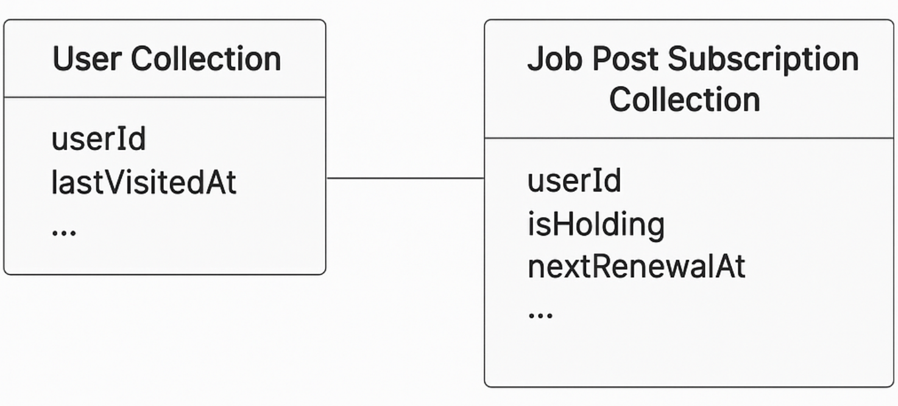

# 구독 알림 배치 성능 최적화

## 개요

사용자의 방문 이력을 기반으로 구독 알림을 중지하는 배치 작업이 점점 느려져, 서비스 운영에 부담을 주고 있었습니다. 매일 수십만 건의 구독 데이터를 전수 조회하는 기존 방식의 병목을 해결하기 위해, **쿼리 범위를 제한하고, 배치 수행 시간을 획기적으로 줄이는 리팩토링**을 주도했습니다.

## 문제 상황

- 알림 구독자 중 `isHolding = false`인 수십만 명을 매일 전수 조회
- 각 사용자의 최근 방문 시간이 14일 이상 경과했는지를 매일 검사
- 실제 상태 변경 대상은 극히 일부에 불과하지만, 전체 문서를 반복 조회
- 기존 배치 소요 시간: **150분 이상**

## 개선 목표

- 불필요한 연산을 줄여 **배치 처리 시간과 DB 부하를 최소화**
- **사용자 수가 증가해도** 일정한 성능을 유지할 수 있는 구조로 개선
- 신규 로직 도입 시 안정적인 마이그레이션과 인덱스 설정을 함께 고려

## 해결 전략

### 1. 구독 상태 갱신 시점 명시

- `nextRenewalAt` 필드를 추가하여 **배치가 해당 도큐먼트만 처리**하도록 구조 변경
- 배치는 `nextRenewalAt = 오늘`인 문서만 조회 → 전체의 극히 일부만 처리

### 2. 조건 기반 로직 분기

- **최근 14일 이내 방문**: `nextRenewalAt`을 14일 후로 연장
- **14일 이상 미방문**: 알림 중단 (`isHolding = true`)

### 3. 안전한 마이그레이션 수행

- 기존 문서에 대해 `nextRenewalAt` 값을 `lastVisitedAt` 기준으로 일괄 설정
- `lastVisitedAt`이 없는 경우엔 다음날로 설정

### 4. 성능 최적화를 위한 인덱스 추가

- `nextRenewalAt` 필드에 대해 **복합 인덱스**를 적용하여 쿼리 효율 극대화

## 성과

- 배치 수행 시간 **150분 → 20초**로 단축 (99.8% 이상 개선)
- 전체 구독자의 약 0.6%만 배치 대상이 되도록 쿼리 범위 최소화
- MongoDB 인덱스를 활용하여 배치 시간과 자원 소모 모두 획기적으로 절감
- 사용자 수 증가와 무관하게 일정한 성능 유지 가능한 구조 확보

## 사용 기술 및 도구

- **MongoDB**: 복합 인덱스 설계 및 성능 최적화
- **Node.js**, **TypeScript**: 배치 로직 작성 및 테스트 자동화
- **스케줄링 & 마이그레이션 전략 설계**
- **데이터 기반 조건 분기 및 상태 관리**

## 개인 기여

- 문제 정의 및 리팩토링 구조 설계 주도
- 마이그레이션 스크립트 및 인덱스 적용
- 신규 로직 테스트 및 배치 안전성 검증
- 운영 환경 반영을 위한 배포 플랜 수립 및 모니터링 지원

## 회고

단순한 필드 추가가 아니라, **전체 배치 흐름을 쿼리 중심으로 재설계한 경험**이었습니다. 배치 성능 문제는 단순히 코드 최적화만으로는 해결되지 않으며, **데이터 모델링, 인덱스 설계, 운영 전략**까지 고려해야 한다는 점을 체감했습니다.
