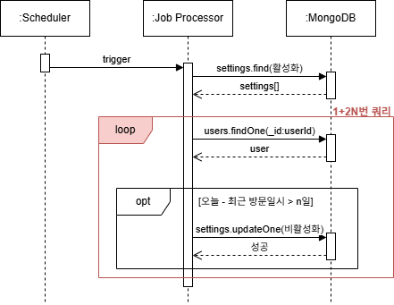
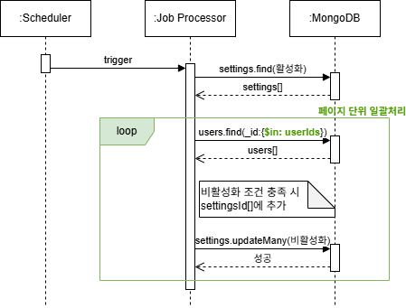

# 알림 비활성화 배치 최적화

## 개요

사용자 최근 방문 시간을 기준으로 알림을 비활성화하는 배치 작업이 점점 느려져, 서비스 운영에 부담을 주고 있었습니다. 매일 수십만 건에 대 1+2N번 쿼리하는 병목을 해결하기 위해, **배치 일시를 추가하고 쿼리를 최적화를** 주도해 **150분에서 20초로** 단축시켰습니다.

#### 사용 기술

- MongoDB: 인덱스 추가, 쿼리 최적화
- Node.js
- 스케줄링: 매일 배치 실행 설정
- `p-throttle`: 작업 제한을 통한 스로틀링 적용
- Slack 알림, Grafana 로그 모니터링

## 문제 상황

- N개의 문서마다 최대 2번의 쿼리를 수행해야 했습니다.
- 처리 대상이 아닌 문서도 항상 모두 조회했습니다.
- 수십만건에 대한 배치 시간이 150분 이상 소요되었습니다.

## 개선 목표

- 불필요한 연산과 쿼리를 줄여 **배치 처리 시간과 DB 부하를 최소화**
- **사용자 수가 증가해도** 일정한 성능을 유지할 수 있는 구조로 개선
- 신규 로직 도입 시 안정적인 마이그레이션과 인덱스 설정

## 문재 해결

### 1. 날짜 필터링으로 연산량 감소

- `nextRenewalAt` 필드를 추가하여, 상태 갱신이 필요한 시점을 명시
- 기존 문서에 대해 `lastVisitedAt` 기준으로 `nextRenewalAt` 초기값 설정
- 시스템 부하 방지를 위해 `p-throttle` 기반으로 스로틀링 적용
  - 200ms당 최대 50개 작업만 실행 (`limit: 50`, `interval: 200`)
  - 드라이런을 통해 스로틀링 값을 검증하고 실제 마이그레이션 수행

### 2. MongoDB 쿼리 성능 개선

- N건당 문제: user 1건당 쿼리 대신 $in 조회로 병렬 최적화
- `nextRenewalAt` 필드에 복합 인덱스를 적용하여 조회 속도 최적화
- 갱신 대상 updateMany로 일괄 처리

## 성과

- 배치 수행 시간 **150분 → 20초**로 단축 (99.8% 이상 개선)
- 사용자 수 증가와 무관하게 일정한 성능 유지 가능한 구조 확보
- MongoDB 부하 감소

## 회고

병목 지점을 정확히 파악하고, 성능 향상 효과가 높은 구간부터 우선 최적화하는 판단이 중요했던 경험이었습니다. 쿼리 최적화에만 집중하는 것이 아니라, 데이터 구조, 처리 방식, 인덱스, 시스템 자원 사용까지 포괄적으로 고려해야 실질적인 성능 개선이 이루어진다는 것을 배웠습니다. 문제를 코드 단위가 아니라 데이터 흐름과 시스템 구조 관점에서 정의하고 접근하는 습관을 가지게 되었고, 성능 개선은 우선순위 선정과 구조적 판단이 중요하다는 점일 배웠습니다.
