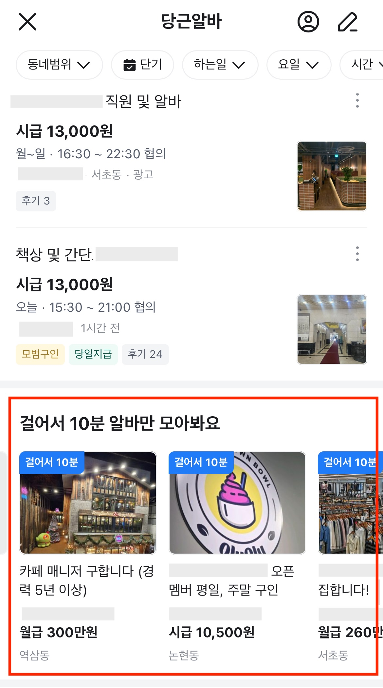
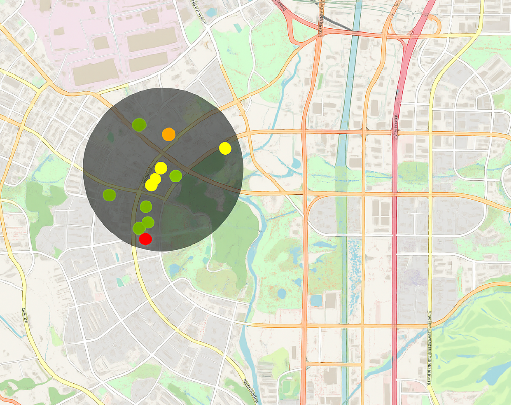

# GeoJSON 기반 지역 검색 정확도 개선

## 개요

<div style="display: flex; align-items: flex-start; gap: 5px;">
  <div style="flex: 2;">
    
    <p style="font-size: 0.9em; color: #888; margin-top: 0;"> 출처: [당근마켓] (앱 내 화면 캡쳐, 2025)</p>
  </div>
  <div style="flex: 3;">
    <p style="text-align: left;">
      당근 알바 플랫폼에서 사용자와 가까운 거리의 게시글을 정확하게 조회할 수 있도록 검색 쿼리를 개선했습니다.<br>
      개선 전후 주요 사용자 지표(노출 수, 클릭률, 지원률 등)를 정량적으로 분석하여 서비스 품질을 향상시킨 프로젝트입니다.
    </p>
  </div>
</div>

#### 사용기술

- Node.js
- GeoJson - [circle-to-polygon](https://www.npmjs.com/package/circle-to-polygon) 라이브러리
- BigQuery, Superset 지표 모니터링

## 문제 상황

기존에는 검색 서비스에서 GeoJSON 기반 공간 쿼리를 지원하지 않아, MongoDB에서 행정구역코드 기반으로 공고를 필터링한 뒤, 좌표 기반 n미터 반경 내 포함 여부를 별도로 판단하는 구조였습니다. 그러나 범위 내에 있더라도 행정구역코드가 일치하지 않아, 게시글이 누락되는 문제가 있었습니다.

## 개선 목표

- 사용자 좌표 기준 반경 내 게시글을 모두 포함하도록 검색 로직 개선
- 개선 전후 클릭률/지원률 등 사용자 반응 지표 정량적 측정

## 문제 해결

1. 검색 서비스에서 GeoJSON 기반 공간 쿼리가 추가되어, 기존 MongoDB 기반 좌표 필터링 로직을 제거하고 검색 단계에서 반경 내 공고 필터링을 직접 수행하도록 구조 개선

    
- 쿼리 예시
  ```json
    {
      "query": "태스트",
      "geo_json": { 
        "type": "FeatureCollection", 
        "features": [ 
          { 
            "type": "Feature", 
            "properties": {}, 
            "geometry": { "type": "Polygon", "coordinates": [ [ [100.0, 0.0], [101.0, 0.0], [101.0, 1.0], [100.0, 1.0], [100.0, 0.0] ] ] } 
          } 
        ] 
      }
    }
  ```

2. 사용자 중심 좌표와 반경을 기반으로 GeoJSON `Polygon` 객체 생성

   `circle-to-polygon` 라이브러리 도입 배경
   GeoJSON은 원형(`Circle`) 영역을 직접 지원하지 않기 때문에, 반경 기반 검색을 구현하려면 원을 근사한 다각형(`Polygon`)이 필요합니다. 직접 위경도 기반 좌표 계산을 구현하는 방식은 정확도 관리와 유지보수 측면에서 비효율적이라 판단하였고, 다음과 같은 이유로 `circle-to-polygon` 라이브러리를 도입하였습니다:

   - 중심 좌표와 반경(m)을 입력하면 GeoJSON `Polygon` 객체 생성
   - 정밀도 조절(`numberOfEdges`) 및 지구 반지름 보정(`earthRadius`) 기능을 제공
   - 생성된 Polygon은 내부 검색 서비스의 GeoJSON 쿼리 조건에 바로 활용 가능
3. 2주동안 BigQuery에 사용자 로그를 적재하고, Superset으로 개선 전후 지표를 시각화하여 정량적 성과를 분석

## 성과

- 평균 노출 공고 수가 기존 5개 미만에서 10개 수준으로 증가
- Superset 기반 대시보드를 구축하여 지표 모니터링을 수행한 결과 다음과 같은 개선 확인
  - 클릭률(CTR): +19%
  - 지원률(CVR): +65%
  - 노출 수: +7%

## 회고

위치 데이터를 처리하기 위해 GeoJson을 사용하고 표준 형식과 좌표 계산을 지원하는 외부 라이브러리를 도입하였습니다. 특히 사용자 반응 지표를 통해 개선 효과를 수치로 검증하며, 실험 중심의 기능 개발 역량을 키울 수 있었습니다.
