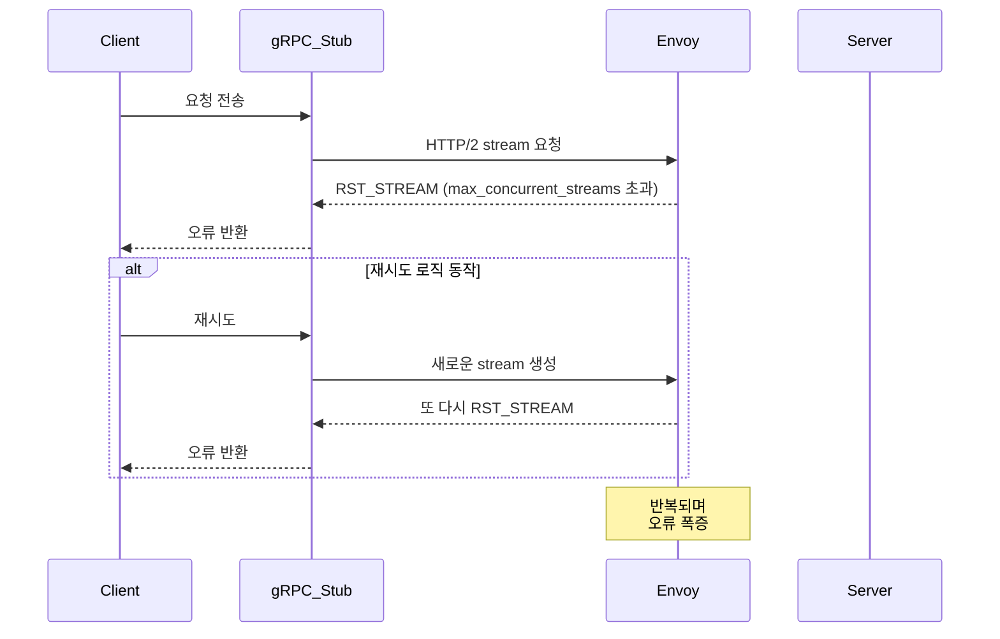

# gRPC 재시도 정책 도입 후 스트림 폭주 문제 대응

## 개요

gRPC 기반 서비스에 재시도 정책을 도입한 이후, 예상치 못한 오류가 발생했습니다.
로그와 서비스 구조, 오픈소스 이슈 분석을 통해 원인을 추정하고, 커스텀 재시도 로직을 도입하여 해결하였습니다.

#### 사용 기술
- Node.js, gRPC.js (`@grpc/grpc-js` v1.11.1)
- Envoy 
- p-retry 라이브러리
- GitHub Issues, 사내 위키
- Grafana 모니터링

## 문제상황

`@grpc/grpc-js`의 자동 재시도 기능 활성화 후, 대량 요청 시 `13 INTERNAL: RST_STREAM with code 0` 오류가 다수 발생하였습니다.
이는 Envoy가 스트림 제한을 초과할 경우 trailer 없이 스트림을 종료하면서, gRPC.js의 내부 재시도 정책이 이를 인식하지 못해 과도한 재시도가 발생했습니다.

## 개선목표

- 재시도에 의한 스트림 폭주 문제 완화
- 오류 발생 상황에 대한 원인 추정 및 대응책 도입
- gRPC 기반 서비스의 응답 안정성 확보

## 해결전략

1. `RST_STREAM with code 0` 오류 파악
2. 현재 인프라 환경과 라이브러리 버전, gRPC 프로토콜과 Envoy 로그를 확인해 trailer 누락 문제를 확인  
  프록시 Envoy가 gRPC 통신에서 스트림을 닫을 때, gRPC 규칙대로 trailer(마지막에 보내는 성공/실패 표시)를 보내지 않고, RST_STREAM(스트림 강제 종료 신호)만 전송  
    1.	Envoy가 `max_concurrent_streams` 제한에 도달 → 스트림 강제 종료(`RST_STREAM`)
    2.	gRPC 규칙상 trailer가 필요하기 때문에, 응답이 제대로 안 왔다고 판단하여 오류(13 Internal)로 처리 → 새 스트림 생성
    3.	새 스트림이 다시 Envoy 제한을 초과 → 더 많은 `RST_STREAM` 발생
    4.	이 과정이 반복되며 오류가 폭증
    - 관련 이슈 및 커뮤니티 및 로그를 확인하여, 장애 상황과 원인 가능성을 추정
    - [`grpc-js` RST_STREAM 관련 이슈](https://github.com/grpc/grpc-node/issues/2569)
    - [Istio + Envoy 환경에서의 유사 이슈](https://github.com/istio/istio/issues/50244)
3. Envoy 1.32.0 에서 trailer 누락 문제 해결 예정: [Envoy PR #16219](https://www.envoyproxy.io/docs/envoy/latest/version_history/v1.32/v1.32.0.html#trailer-handling)
    - 그러나, Envoy 업그레이드가 어려운 상황이므로, 대안으로 커스텀 재시도 로직 도입
4. [`p-retry`](https://github.com/sindresorhus/p-retry)를 사용해 직접 구현하여 재시도 간격을 조절
    
    ```typescript
    async function callWithRetry(request) {
      return pRetry(
        () => asyncPromise(request),
        {
          retries: 3, // 최대 재시도 횟수
          factor: 2, // 지수 백오프 
          minTimeout: 300, // 최초 재시도 간격 ms
          maxTimeout: 5000, // 최대 재시도 간격 ms
          shouldRetry: (error) => {
            return [grpc.status.UNAVAILABLE, grpc.status.DEADLINE_EXCEEDED].includes(error.code);
          },
          onFailedAttempt: error => {
            logger.warn(`gRPC 재시도 시도: ${error.attemptNumber}회 (${error.retriesLeft}회 남음), 에러: ${error.message}`);
          }
        }
      );
    }
    ```

## 성과

- p-retry 적용 이후, 기존에 오류가 자주 발생하던 gRPC 기반 프로세스들의 요청 성공률 개선
- 클라이언트 재시도가 제어되며, 서비스 처리 흐름이 안정화
- 운영 중이던 오류성 API 호출에 대한 내부 대응 부담이 감소

## 회고

gRPC 재시도 정책이 Envoy의 max concurrent streams 제한과 충돌하면서 발생한 문제를 통해, 라이브러리 버전과 인프라 환경이 애플리케이션 안정성에 치명적임을 체감했습니다.
오픈소스 이슈와 커뮤니티 자료를 적극적으로 활용하는 경험을 쌓고 관련 내용을 팀 내부에 정리해 공유했습니다.
