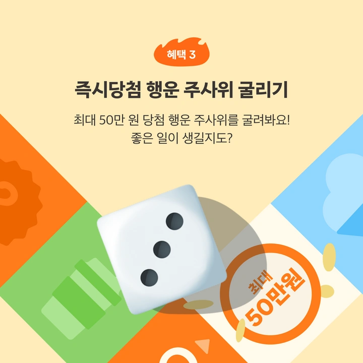

# 복권 프로모션 지급 시스템

## 개요

  

    
    

출처: <a href="https://www.daangn.com/kr/business-post/%EB%8B%B9%EA%B7%BC%EC%95%8C%EB%B0%94x%EC%98%A4%ED%95%B4%EC%9B%90-%EC%97%AC%EB%A6%84%ED%9C%B4%EA%B0%80-%ED%8C%A8%ED%82%A4%EC%A7%80%EB%B6%80%ED%84%B0-%EC%BA%90%EC%8B%9C-%EB%B3%B4%EC%83%81%EA%B9%8C%EC%A7%80-%EC%82%AC%EC%9E%A5%EB%8B%98%EB%8F%84-%EC%9E%98-%EB%B2%8C%EC%97%88%EC%8A%B5%EB%8B%88%EB%8B%A4-8t65mfn2yob1/?in=%EC%84%9C%EC%B4%88%EB%8F%99-6128" target="_blank" style="color: #888; text-decoration: underline;">[당근 공식 사이트] (당근사장님학교 글, 2024)</a>

  

  

    

        당근마켓 알바 플랫폼의 2024년 여름 프로모션 ‘행운 주사위' 사용자 행동 기반으로 리워드를 자동 지급하는 시스템입니다. 본 프로젝트에서는 공통 프로세스를 상속받아, 해당 프로모션 조건에 맞는 지급 흐름을 구현하고, 이벤트 기반 아키텍처 환경에서 복권을 지급하고 장애를 대응했습니다.
    

  

## 문제 상황

- 프로모션 페이지 최초 진입 시 기본 행운 주사위 1개 자동 지급
- 사용자가 공유한 초대 링크를 친구가 열람하면, 초대자와 친구 모두에게 각각 1개씩 추가 지급
- 보유한 복권 개수 표시, 중복 지급 방지, 지급 조건 검증 필요
- 24일(240708~240731)간 128401명 당첨 예정 - *공개된 정보입니다.*

## 문제 해결

1. 최초 자동 지급 처리

- 프로모션 페이지 방문 시 Kafka를 통해 지급 이벤트 발행
- Redis에 보유 개수를 캐싱하여 빠른 응답 및 UI 노출 보장
- MongoDB에 지급 이력을 저장하여 중복 지급 방지

2. 친구 초대 기반 지급

- 사용자가 공유한 링크를 타인이 열람 시, 공유자와 열람자 모두에게 1개씩 지급
- 링크 클릭 이벤트를 수집 후 조건 검증(최초 접속 등)하여 비동기 지급 처리
- Agenda.js 기반 스케줄러로 이벤트 큐 처리

3. 리워드 당첨 처리
4. 장애 대응 로직 적용

- Redis 캐시에 보유 개수가 없을 경우 임시 1개 지급된 것처럼 응답 처리
- 지급-조회 간 타이밍 이슈에 따른 일관성 문제 해소

## 성과

- 수십만 명의 사용자 참여가 이루어진 이벤트에서 안정적인 지급 및 조회 처리
- 이벤트 기반 복권 지급 시스템 구현
- 보유 복권 개수 문의 발생 3시간 이내 대응 및 복구

## 회고

사용자의 참여 행동(접속, 공유, 클릭)에 따라 보상을 유연하게 제공해야 했던 프로젝트로, 비동기 이벤트 처리와 상태 기반 분기에 대한 이해가 요구되었습니다. 이벤트성 시스템의 실시간성, 데이터 정합성, 확장성에 대한 기술적 성장의 기회가 된 경험입니다.

## 참고 자료

- [당근알바 2024년 여름 프로모션 페이지 (이벤트 종료)](https://daangn-jobs-campaign-2024-summer.karrotwebview.com/applicant?af_xp=custom&source_caller=ui&pid=brand_user&is_retargeting=true&shortlink=bvzgpdpt&af_adset=jobs&af_ad=summer_240704_inapp&deep_link_value=karrot%3A%2F%2Fminikarrot%2Frouter%3Fremote%3Dhttps%253A%252F%252Fdaangn-jobs-campaign-2024-summer.karrotwebview.com%252Fapplicant%26navbar%3Dtrue%26scrollable%3Dtrue&c=inapp_contents)
