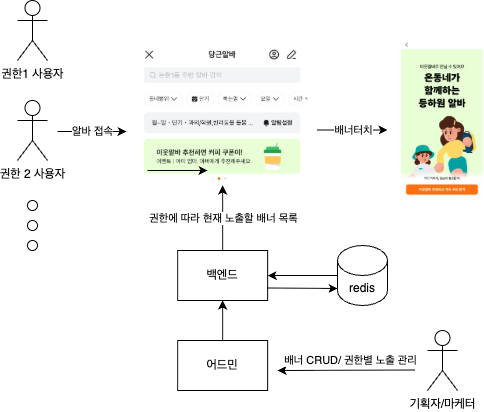

## 개요

  

    
    
 출처: [당근마켓] (앱 내 화면 캡처 , 2025)

  

  

    

      어드민에서 사용자 권한(role)에 따라 배너의 종류와 순서를 관리할 수 있는 시스템을 설계하고 구현했습니다. 
      근시일 어드민 개편을 대비해 관리 편의성을 고려해야했고 데이터를 Redis에 저장했습니다.
       
      React로 어드민 배너 CRUD 및 권한별 노출 관리 기능을 제공하고, 앱내에서 호출하는 배너 조회 API를 구현했습니다.
    

  

#### 사용기술

- Node.js, GraphQL, Redis, React

## 문제 상황

기존에는 마케팅 배너를 프론트엔드 코드에 하드코딩하여 등록했기 때문에, 배너 변경 시마다 개발 리소스가 반복적으로 투입되고 매번 배포가 필요했습니다. 마케터가 관리자 페이지를 통해 직접 배너를 등록하고 관리할 수 있도록 개편해야 했으며, 이에 따라 각 부서 의견을 조율하여 백엔드, 어드민 UI/UX 설계 및 기능 구현을 전반적으로 담당했습니다.

## 개선 목표

- 사용자 권한별로 배너를 지정하고 순서 정렬
- 어드민 페이지에서 직접 배너를 등록/수정/삭제
- 이후 변경에 유연하게 대응할 수 있도록 Redis 기반 데이터 저장소 설계
- 노출 시간 조건을 서버에서 관리하여 실시간으로 정확한 배너 노출 보장

## 문제 해결

### 1. Redis 구조 설계

### 1-1. 배너 데이터 (`Banner_detail:{bannerId}`)

1. `Hash` 구조

   장점:

   - 단일 필드 접근 시 `HGET` 명령어로 O(1) 시간복잡도로 조회 가능
   - `HSET`을 이용해 배너 제목/이미지 URL만 수정 가능

   단점:

   - 필드 값으로 검색 기능이 없어서 노출 시간 필터링이 어려움
   - TTL 설정이 전체 해시에 적용됨
2. `SortedSet`

   장점:

   - score에 timestamp를 넣으면 `ZRANGEBYSCORE`로 특정 기간 배너 조회 가능
   - score로 다차원 정렬/필터링 가능

   단점:

   - 단일 배너 정보 조회 시 `HGET`보다 느림 O(log(N)) 시간 복잡도
   - value에 JSON 등으로 직렬화 필요, 부분 필드 수정 불가

### 1-2. 배너 노출 순서 제어 (`Banner_order:{Role}`)

1. `SortedSet` 구조

   장점:

   - 사용자 권한별 배너 노출 우선순위 관리: `ZADD`로 순위 조정 가능
   - `ZRANGE`로 특정 범위만 조회 가능

   단점:

   - 단순 순서만 필요할 땐 복잡한 구조
2. `List`

   장점:

   - `LPUSH`/`RPUSH`로 순서 관리가 간단함
   - `LRANGE`로 전체 순서 조회 가능

   단점:

   - 우선순위 변경 시 전체 리스트 재구성 필요
   - 특정 조건으로 필터링하려면 애플리케이션에서 처리해야 함

### 1-3. 결론: 배너 상세 정보는 `Hash`, 권한별 노출 순서는 `List`로 관리

- 월 5건 미만으로 배너양이 적음
- 배너 순서가 드물게 변경됨
- 단순 순서만 유지하면 List로 충분

### 2. 앱 메인화면 배너 조회 API

앱 메인화면 진입 시, 서버는 현재 시각과 사용자 권한을 기준으로 배너 목록을 반환하는 API를 제공합니다. 이 API는 다음 기준을 기반으로 배너를 필터링하고 정렬합니다.

- 현재 서버 시각이 배너의 노출 시작 및 종료 시간 범위에 포함되는지 확인
- 사용자 권한에 따라 Redis의 `List`에서 노출 우선순위에 맞는 배너 ID 목록 조회
- 각 배너의 상세 정보를 `Hash`에서 조회하여 정렬된 리스트로 응답 구성

이를 통해 클라이언트는 실시간으로 유효한 배너만 렌더링하며, Redis 캐시를 활용해 빠른 응답성과 정확한 노출이 가능합니다.

### 3. GraphQL Mutation 및 어드민 UI 구현

- 배너 생성 시, 필수 입력값 및 유효성 검증
- ▲▼ 버튼 클릭으로 권한별 배너 노출 순서 조정 기능 제공
- 배너 목록 화면과 실시간 노출/숨김 구현

## 회고

이 프로젝트에서 요구사항에 맞는 Redis 자료구조를 선택하며 트레이드오프를 고민했습니다. Redis는 속도 측면에서 유리하지만 복잡한 기능 구현에는 제약이 있었고, 각 자료구조의 장단점을 비교하며 목적에 맞는 구조를 선택해야 했습니다.
퇴사 당일, 팀원분이 알파서버에 롤링페이퍼를 담은 배너를 띄워주셨습니다. 제가 구현한 기능이 동료 간의 인사를 전하는 수단으로도 쓰였다는 사실에 깊은 인상을 받았고, 감사함을 느꼈습니다.
